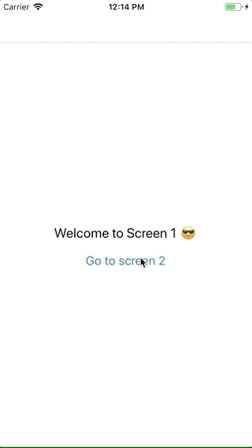

# react-navigation-example

## Description

This repository is a simple example to demonstrate you how to use react-navigation (v3) with redux, react-redux, react-native etc. 

## Install

```
$ yarn
```

## Demo

# [](https://github.com/rimiti/react-navigation-example)


## How to run it?

```bash
$ react-native run-ios
```

## License
MIT © [Dimitri DO BAIRRO](https://github.com/rimiti/react-navigation-example/blob/master/LICENSE)
